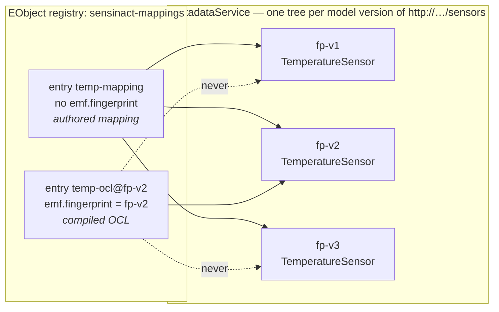
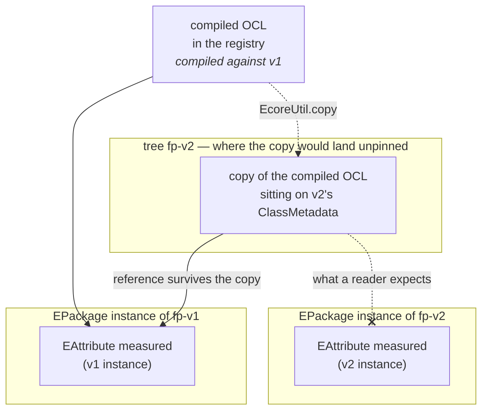
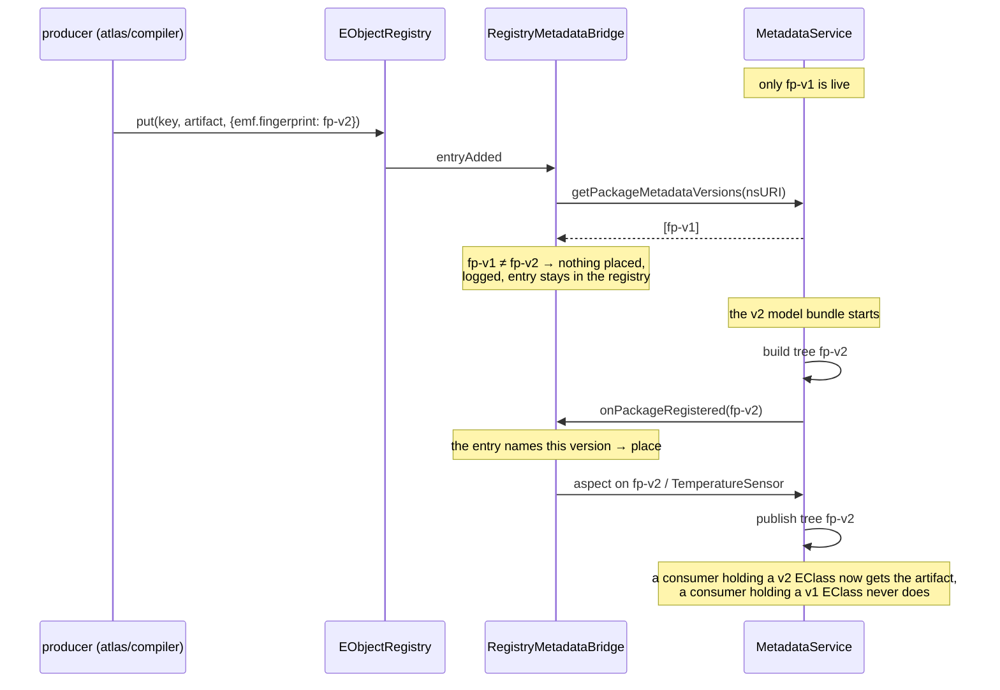

# Named EObject Registries

`org.eclipse.fennec.emf.osgi.eobject.registry` provides **named, local registries for
authored EObject content** — provider mappings, mapping profiles, OCL expression
libraries, service configurations. A registry is fed by pluggable content sources
(files, a model atlas, a database) and stays available even when a remote source is
not. The companion bundle `org.eclipse.fennec.emf.osgi.eobject.registry.metadata`
bridges registry content onto the metadata service, so runtime code holding an
`EClass` finds the content through one uniform lookup.

Authoritative design record: issues [#72](https://github.com/eclipse-fennec/emf.osgi/issues/72)–[#77](https://github.com/eclipse-fennec/emf.osgi/issues/77).

## The problem this solves

Runtime code — a codec, a sensinact mapper, an OCL evaluator — holds an `EClass` and
needs the authored content that belongs to it. Getting that content in an OSGi runtime
traditionally runs into four problems at once:

1. **Where does the content live?** In files shipped with the deployment, or in a
   remote model atlas. The consumer must not care, and a *remote* source must never be
   a runtime dependency: an unreachable atlas must not cost the locally held mappings.
2. **Start ordering.** DS gives no activation ordering. Content sources, model bundles
   and consumers start in arbitrary order; naive wiring silently loses whatever
   arrived "too early" (the bug class of issue #71).
3. **Model versions.** Metadata identity is the model **fingerprint**, not the nsURI.
   A re-registered or bumped package starts with a fresh tree — content anchored to
   the old version silently disappears unless something re-contributes it.
4. **Service churn.** Publishing every EObject as its own OSGi service (the previous
   sensinact approach) means per-object `ServiceRegistration` lifecycle, ordering
   invariants (register-before-unregister) and whiteboards per content type.

The registry answers all four with one pattern: **gated publication** (the registry
service only appears fully loaded), **two replays** (listeners get current content on
bind; metadata handlers re-contribute onto new model version trees), and **per-source
sync semantics** (a source's failure or death never touches other sources' content).

## The pieces

| Piece | Role |
|---|---|
| `EObjectRegistry` | read face: `get(key)`, `getEntry(key)`, `entries()`, listeners. Keys are strings, **unique per registry**; the key convention is per domain (a mapping id, an EClass URI, a library name). |
| `EObjectRegistryWriter` | write face for content sources: `put`, `remove`, `sync(source, entries)`. Both faces are one service instance, registered under both interfaces (the `MetadataService`/`MetadataWhiteboard` precedent). |
| `EObjectProvider` | SPI of the **one pulled initial provider** per registry: `CompletableFuture<Void> load(writer)`. Dynamic sources implement nothing — they are writer clients. |
| `FileEObjectProvider` | the default initial provider: loads EObjects from local files. |
| `EObjectRegistryListener` | change notification with replay; also usable as a whiteboard service. |
| `RegistryMetadataBridge` | listener **and** `MetadataHandler`: content appears as `AspectEntry` on `ClassMetadata`, per live model version. |

**Entry shape.** `EObjectRegistryEntry(key, object, source, properties)`. `source` is
the **technical origin** — the input channel that wrote the entry (the provider
instance name, e.g. `mapping-files`, `atlas-jena`) — and scopes `sync`. It is *not*
the model origin: model anchoring goes into the entry `properties` under the existing
conventions `emf.nsURI` / `emf.fingerprint` — and `emf.fingerprint` is more than
provenance, it decides which model versions the content reaches (see
[the metadata bridge](#the-metadata-bridge)). Example — a sensinact mapping fetched
from an atlas: key = the mapping's `mid`, source = `atlas-jena`, properties =
`emf.nsURI`, `emf.fingerprint`, `atlas.scope`, `atlas.registry`, `atlas.object.id`.

## Wiring a registry (OSGi)

Three factory configurations (OSGi Configurator JSON), nothing else:

```json
{
  ":configurator:resource-version": 1,

  "FileEObjectProvider~mappings": {
    "emf.eobject.provider.name": "mapping-files",
    "locations": [ "/opt/app/mappings" ],
    "key.feature": "mid",
    "file.extensions": [ "xmi", "mapping" ]
  },

  "EObjectRegistry~mappings": {
    "name": "sensinact-mappings",
    "initialProvider.target": "(emf.eobject.provider.name=mapping-files)"
  },

  "EObjectRegistryMetadataBridge~mappings": {
    "emf.eobject.registry.name": "sensinact-mappings",
    "aspect.type.id": "sensinact.mapping"
  }
}
```

### Which files a directory contributes

A directory is walked recursively, but only files whose extension is in
`file.extensions` are handed to EMF; dotfiles never are. A `.keep` placeholder, a
`README.md`, a `.DS_Store`, an editor's `.swp` file are passed over quietly (logged at
`FINE`), so **a warning from the provider means a real model file failed to parse** —
which is the only way that signal stays worth reading.

| Setting | Effect |
|---|---|
| absent | the default `xmi`, `ecore`, `json`, `xml` |
| `[ "xmi", "mapping" ]` | those two, matched case-insensitively; a leading dot is tolerated |
| `[]` (explicitly empty) | attempt **every** file in the directory (dotfiles still excluded) |

A `locations` entry that names a **file** directly is always loaded, whatever it is
called — naming it is deliberate, and the allow-list only governs what a walk picks up
on its own.

> **Behaviour change.** Before this, every regular file found was parsed. If your models
> carry a domain extension (`persons.basic`, `x.mapping`) rather than one of the four
> defaults, list it in `file.extensions` — or set `[]` to get the previous
> attempt-everything behaviour back.

Lifecycle: the registry component activates only when SCR satisfied the
`initialProvider` reference (a missing provider is a visible unsatisfied reference in
`scr:info`), runs `load()` on a private executor — activation never blocks — and
registers the `EObjectRegistry` + `EObjectRegistryWriter` services **only after the
load completed**. A failed load is logged and the registry stays unpublished; the
absent service is the signal. There is no `@Modified`: any configuration change
restarts the instance.

Consumers reference by name and are, by construction, never activated against a
half-loaded registry:

```java
@Reference(target = "(emf.eobject.registry.name=sensinact-mappings)")
private EObjectRegistry mappings;
```

Dynamic sources (a model atlas client, anything network-dependent) push through the
writer — and because the writer service only exists after initialization, they cannot
write too early, and their death simply leaves their content in place:

```java
@Reference(target = "(emf.eobject.registry.name=sensinact-mappings)")
private EObjectRegistryWriter writer;

// per refresh pass, per atlas registry scope:
writer.sync("atlas-jena", fetchedEntries);   // identity compare, update-before-remove,
                                             // removes only atlas-jena's gone entries
```

## Without OSGi

The core is plain Java (`CompletableFuture`, no framework types), same split as
`MetadataServices`:

```java
EObjectRegistryWriter writer = EObjectRegistries.createRegistry("sensinact-mappings",
        new FileEObjectProvider("mapping-files", resourceSet,
                List.of(Path.of("/opt/app/mappings")),
                FileEObjectProvider.featureKeys("mid")));
EObjectRegistry registry = writer.getRegistry();   // fully loaded when this returns
```

The four-argument constructor applies `FileEObjectProvider.DEFAULT_FILE_EXTENSIONS`; a
fifth argument takes the extension allow-list explicitly (an empty collection attempts
every file):

```java
new FileEObjectProvider("mapping-files", resourceSet, List.of(Path.of("/opt/app/mappings")),
        FileEObjectProvider.featureKeys("mid"), List.of("xmi", "mapping"));
```

## The metadata bridge

The bridge makes `MetadataService.getClassAspect(eClass, typeId)` the uniform,
model-anchored read surface for registry content. It is both an
`EObjectRegistryListener` (content changes flow onto the trees of the model versions an
entry belongs to) and a `MetadataHandler` (new fingerprint trees get the current content
re-contributed).

**Anchor resolution** is domain-specific and pluggable (`AspectAnchorResolver`,
selected via `anchorResolver.target`): the default anchors at the content's own
`eClass()`; a sensinact resolver anchors a mapping at its
`ProviderMapping.getProviderClasses()` — one entry, many anchors.

### Which model versions an entry reaches

One nsURI can have several live model versions at the same time — a draft next to an
approved stage, a bumped model next to the one consumers still hold. Each is its own
`PackageMetadata` tree, keyed by [fingerprint](model-fingerprint-guide.md). So when the
bridge places registry content as an aspect, it has to decide **which of those trees** the
content belongs on. The entry decides, through `emf.fingerprint`:

- **No fingerprint ⇒ version-independent.** The content goes onto *every* live version
  of its anchor's nsURI. This is what makes a version bump cost nothing for mappings,
  profiles and resolved configuration.
- **A fingerprint ⇒ derived, pinned to that version.** The content goes onto that
  version and no other, and waits if the version is not deployed yet.
- **A blank or multi-valued fingerprint states no version** and is read as unknown, never
  as a mismatch — the rule `EPackage#fingerprint()` lays down for the whole contract. A
  single-element array or collection (the shape a value takes when properties are copied
  from service properties or Configurator JSON) is unwrapped.



A consumer never sees this decision. It holds an `EClass` and asks
`getClassAspect(eClass, typeId)`; because the `EClass` instance belongs to exactly one
version, it gets that version's answer — the authored mapping on all three, the compiled
OCL only on `fp-v2`.

#### Why pinning matters: what a copy carries

`AspectEntry#content` is a containment slot, so the bridge stores a **copy** of the
registry object (`EcoreUtil.copy`) rather than stealing the live object out of its
resource. That copy is deep for containment — and it leaves every **non-containment**
reference pointing at the **original** target. For authored content that holds no model
references, this is invisible. For a *derived* artifact it is the whole story: compiled OCL
holds the `EStructuralFeature` and `EClassifier` instances it resolved against while
compiling.



The copy sits on v2's tree and navigates **v1's** features. Two failure shapes follow, and
neither is loud:

| Model style | What happens |
|---|---|
| Dynamic EMF (`EcoreUtil.create`, loaded `.ecore`) | `eGet` with a feature that is not this class's feature → `IllegalArgumentException` at the first evaluation |
| Generated code | the feature may resolve **by name** and quietly answer from the wrong model version — a wrong value, no exception |

> **Content that holds references into the model MUST carry `emf.fingerprint`.** Naming
> the version is what keeps the copy and its references on the same version (issue #81).
> Pinning is not an optimization; for derived content it is the correctness condition.

Because placement is narrowed this way, **placement is also provenance**: the
`modelFingerprint` of the `PackageMetadata` containing an aspect *is* the fingerprint of
the package its content was built from. There is no second bookkeeping to keep in sync.

#### Producing derived content: the order-free shape

Derive from the model, then push into the registry with the version named. The bridge does
the rest — including the case where the model is not there yet.

```java
@Component
public class OclCompiler {

    @Reference(target = "(emf.eobject.registry.name=compiled-ocl)")
    private EObjectRegistryWriter registry;

    /** One EPackage service per live model version, each carrying its fingerprint. */
    @Reference(cardinality = ReferenceCardinality.MULTIPLE, policy = ReferencePolicy.DYNAMIC)
    void addModel(EPackage ePackage, Map<String, Object> properties) {
        String fingerprint = (String) properties.get(EMFNamespaces.EMF_MODEL_FINGERPRINT);
        for (EClass eClass : classesOf(ePackage)) {
            EObject compiled = compile(eClass);       // resolves against THIS instance
            registry.put("ocl-compiler",
                    eClass.getName() + "@" + fingerprint,   // key carries the version
                    compiled,
                    Map.of(EMFNamespaces.EMF_MODEL_NSURI, ePackage.getNsURI(),
                           EMFNamespaces.EMF_MODEL_FINGERPRINT, fingerprint));
        }
    }

    void removeModel(EPackage ePackage, Map<String, Object> properties) {
        // leaving the entries in place is fine: they are pinned, so they simply go pending
        // until that version returns. Remove them if the memory matters.
    }
}
```

Two things in that snippet are the whole convention:

**The key carries the version.** Registry keys are flat and unique *per registry*, so if
three versions each contribute an artifact for `TemperatureSensor`, three distinct keys are
needed. With one key the second `put` overwrites the first — last write wins, logged, one
entry left. `emf.fingerprint` governs *placement*, never key identity.

**The fingerprint comes from the model, not from a guess.** Read it from the `EPackage`
service property, or compute it — `metadataService.getPackageMetadata(ePackage)` →
`getModelFingerprint()`, or `FingerprintHelper.fingerprint(ePackage)` before any
registration. Both give the same value.

> **Do not derive inside `MetadataHandler.onPackageRegistered` and push from there.** The
> new tree is published only *after* all handlers ran, and handlers run in registration
> order — so whether the bridge sees your entry for the tree being built depends on wiring
> order. Reacting to `EPackage` services, as above, has no such dependency: the bridge's
> replay places the content whenever the tree exists, before or after.

#### Legacy models without an advertised fingerprint

A model generated before the scheme existed, or a plain `.ecore` loaded at runtime,
advertises no `emf.fingerprint`. That changes nothing here, because metadata identity is
**computed**: `MetadataService` fingerprints every version it registers and treats a
supplied value as context, never as truth. Read the computed value and pin against it —
a legacy model gets exactly the same guarantee as one that advertises its fingerprint.

#### When content reaches nothing

| Situation | Behaviour |
|---|---|
| No version of the nsURI is live yet (cold start, model bundle still starting) | silent — normal, the replay places the content on registration |
| The named version is not among the live ones | logged, entry stays pending in the registry |
| The named version is live but dropped the anchor class | logged, nothing placed |
| The entry names no version and no live version carries the anchor class | logged |

The rule behind the table: narrowing trades a silent *misplacement* for a silent
*absence*, so an absence that is not simply "too early" is reported.

**Boundaries** (deliberate):

- The aspect content is a **copy** of the registry object — `AspectEntry#content` is a
  containment slot, and the live object stays where it is. The metadata face is
  *snapshot lookup*: aspects emit no change events and do not update the metadata
  index. Consumers needing dynamics listen to the registry.
- Id-based lookups (`getProfile(profileId)`-style) stay with the registry.
- One anchor class carries at most **one aspect per type id** (last write wins,
  logged). Domains with many entries per anchor — sensinact's
  `List<ProviderMapping>` per EClass — keep the registry (or a typed facade over it)
  as their query face; the aspect is the model-anchored entry point, not a query API.

## The use cases, walked through

Each of these is a test in
`org.eclipse.fennec.emf.osgi.eobject.registry.metadata` (`InitialProviderBridgeUseCasesTest`)
and, end-to-end in Felix, in `org.eclipse.fennec.emf.osgi.eobject.registry.itest`.

**1. The normal day — model first, then content.** The sensor model bundle is active,
the registry loads its mapping files, the bridge attaches. Runtime code holding
`TemperatureSensor` asks `getClassAspect(temperatureSensor, "sensinact.mapping")` and
gets the mapping. *Problem solved: no per-object services, no static registry, one
lookup face.*

**2. The late model bundle — content first.** The mapping files load before the sensor
model registers; at that point no aspect exists (there is no tree to attach to). The
moment the model registers, the bridge's handler replay contributes the aspects onto
the fresh tree. *Problem solved: DS start ordering cannot lose content — the #71 bug
class is structurally impossible here.*

**3. The model version bump.** A second, diverging version of the sensor model
registers (same nsURI, new fingerprint) while the first stays live. The new version
starts with an empty tree — the bridge re-contributes, and for version-independent
content both versions answer the lookup. *Problem solved: fingerprint identity does not
silently drop content on re-registration or version bumps.*

**3b. The derived artifact at a version bump.** The same bump, but the entry carries
`emf.fingerprint` — compiled OCL, derived from one package instance. It stays on the
version it names; the new version does **not** get a copy that would navigate the old
package's features, and the authored, version-independent mappings next to it keep
spanning both versions. *Problem solved: the read face cannot reintroduce the
cross-version mix-up that fingerprint identity exists to prevent.*

**3c. The derived artifact ahead of its model.** The compiler ran against a version that
is not deployed yet (a staged rollout, an atlas that already knows the next model). The
entry names that version, waits, and lands the moment it registers — the replay of case
2, narrowed to one version instead of all of them. *Problem solved: pinning costs nothing
in start ordering.*



The tree is published only *after* the handlers ran, so no reader can ever observe a
version whose aspects are still missing.

**4. The dynamic source updates.** An atlas client pushes a corrected mapping under a
key the files provided initially: the registry entry updates (last write wins across
sources, logged), the aspect snapshot follows. An *unchanged* re-push — the atlas
ETag cache returns the identical instance — is a complete no-op: no event, no aspect
churn. *Problem solved: cheap periodic refreshes, updates flow through to the
model-anchored lookup.*

**5. The source disappears.** The atlas reports its content gone (`sync` with the
remainder) or simply stops syncing (then nothing changes at all). Only atlas-owned
entries and their aspects go; file-provided content is untouched. *Problem solved:
the resilience requirement — an unreachable remote source never costs the locally
held content.*

**6. The late bridge.** Registry and model are long up when a bridge (or a second one
with another type id) arrives: the listener replay hands it the complete current
content. *Problem solved: late wiring is indistinguishable from early wiring.*

**7. One entry, many anchors.** A mapping applies to several sensor classes
(`getProviderClasses()`): the resolver returns all of them, every anchor answers,
removal clears every anchor. *Problem solved: n:m between content and model classes
without duplicating content.*

## Distinction from the model.atlas server registry

The model.atlas `EObjectRegistryService`/`ObjectMetadata` API is the **management
plane**: catalog, stages, approval, storage back ends. This registry is the **edge
plane** holding the actual EObjects locally at a consumer. The atlas client feeding
this registry is a writer client of the edge plane and a consumer of the management
plane.

## Property reference

| Property | Where | Meaning |
|---|---|---|
| `emf.eobject.registry.name` | registry services, listener whiteboard services, bridge config | the registry instance name |
| `emf.eobject.provider.name` | provider services | selected by `initialProvider.target` |
| `emf.eobject.registry.content.types` | registry services (optional) | declared content types for discovery |
| `emf.nsURI` | entry properties | the model the entry's content belongs to |
| `emf.fingerprint` | entry properties | the **model version** the content was derived from. Present ⇒ the aspect is placed on that version only; absent ⇒ version-independent, placed on every live version. Mandatory for content holding references into the model. |
| `file.location` | entry properties (file provider) | absolute path the entry was loaded from |

Constants: `EObjectRegistryConstants` (registry bundle), `FileEObjectProvider.PROP_*`.
